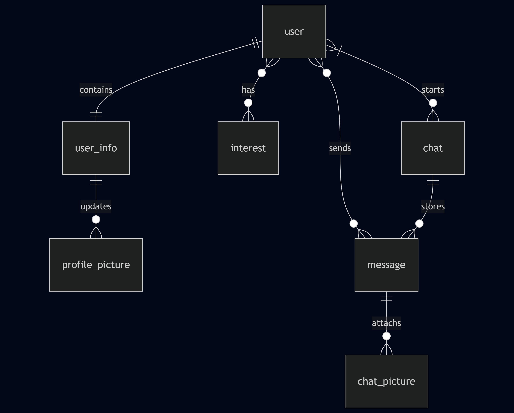

# Design Document

By Kai Yin NG

Video overview: <[CS50 SQL Final Project Video](https://www.youtube.com/watch?v=dRlqbtW8ITg)>

## Scope

The database for the friend-matching application is designed to support personal profile building and user matching based on interests and location, as well as one-to-one chat functionality for successfully matched users. The database's scope includes the following entities:

*   **Users**: This entity encompasses information vital for user login, data privacy, and other system functions. It also includes personal data intended for public display and information crucial for friend matching, such as geographical location.
*   **Chats**: This entity records information about conversations between two users, including the participants and the time the chat was initiated.
*   **Messages**: This entity stores encrypted message content along with essential metadata like the sending time and sender.
*   **Photos**: This entity manages various photo types, including profile pictures displayed on user profiles and images exchanged within chat rooms.
*   **Interests**: This entity defines different types of interests used to facilitate friend matching.

Sensitive personal data, such as users' phone numbers or detailed, unencrypted message content, falls outside the direct storage scope of this database.

## Functional Requirements

This database is designed to support a friend-matching application accessible via web or mobile interfaces. Broadly, it provides the following functionalities:

*   **User, Chat, and Message Management**: The database supports full Create, Read, Update, and Delete (CRUD) operations for user accounts, chat rooms, and individual messages.
*   **Friend Discovery**: Users can find potential friends based on geographical location and shared interests.
*   **Private Communication**: A private chat room feature is available, enabling one-to-one text and media communication between matched users.

However, the application does not support direct voice or video calls between users, nor does it provide real-time location tracking.

## Representation

### Entities

The database includes the following entities:

#### Users

The `users` table includes:

*   `id`, which specifies the unique ID for the user as an `INT UNSIGNED`. This column thus has the `PRIMARY KEY` constraint applied and is `AUTO_INCREMENT` to automatically generate unique IDs.
*   `username`, which specifies the user's chosen username as `VARCHAR(32)`. A `NOT NULL` constraint ensures a username is always provided, and a `UNIQUE` constraint ensures no two users have the same username.
*   `password`, which stores the hashed password as `VARCHAR(128)`. This column is `NOT NULL`.
*   `email`, which stores the user's email address as `VARCHAR(320)`. This column is `NOT NULL` and `UNIQUE`.
*   `created_at`, which specifies the timestamp when the user account was created. This column is of type `TIMESTAMP` and is `NOT NULL`. The default value for this attribute is the current timestamp, as denoted by `DEFAULT CURRENT_TIMESTAMP`.
*   `updated_at`, which specifies the timestamp of the last update to the user's record. This column is of type `TIMESTAMP` and is `NOT NULL`, with `DEFAULT CURRENT_TIMESTAMP ON UPDATE CURRENT_TIMESTAMP` to automatically update its value whenever any other column in the row is modified.
*   `closed`, which is a `TINYINT` representing a boolean (0 for false, 1 for true) indicating if the account is in the deletion process. It is `NOT NULL` with a `DEFAULT` value of `0`.
*   `closed_date`, which stores the date when the account deletion process was initiated. This column is of type `DATE` and can be `NULL`.

#### User_infos

The `user_infos` table stores public-facing personal information for users. It includes:

*   `user_id`, which specifies the unique ID for the user as an `INT UNSIGNED`. This column serves as the `PRIMARY KEY` for this table and also as a `FOREIGN KEY` referencing the `id` column in the `users` table. An `ON DELETE CASCADE` constraint ensures that if a user is deleted, their corresponding `user_infos` record is also deleted.
*   `name`, which specifies the user's display name as `VARCHAR(64)`. This column is `NOT NULL`.
*   `main_profile_pic_id`, which is an `INT UNSIGNED` referencing the `id` of the user's currently selected main profile picture in the `profile_pictures` table. This column has default value of `NULL` and has an `ON DELETE SET NULL` constraint, meaning if the referenced profile picture is deleted, this field will be set to `NULL`.
*   `date_of_birth`, which stores the user's birth date as `DATE`. This column is `NOT NULL`.
*   `location_country`, which stores the user's country as `VARCHAR(64)`.
*   `location_city`, which stores the user's city as `VARCHAR(64)`.
*   `occupation`, which stores the user's occupation as `VARCHAR(64)`.
*   `education`, which stores the user's education background as `VARCHAR(64)`.
*   `bio`, which stores the user's biography as `VARCHAR(600)`. This column can be `NULL`.
*   `online`, which is a `TINYINT` representing a boolean (0 for false, 1 for true), indicating the user's online status. It is `NOT NULL` with a `DEFAULT` value of `0`.
*   `last_seen`, which specifies the timestamp of the user's last activity. This column is of type `DATETIME` and is `NOT NULL`, with `DEFAULT CURRENT_TIMESTAMP ON UPDATE CURRENT_TIMESTAMP` to automatically update its value upon any record modification.

#### Chats

The `chats` table stores information about two-person chat rooms. It includes:

*   `id`, which specifies the unique ID for the chat as an `INT UNSIGNED`. This column thus has the `PRIMARY KEY` constraint applied and is `AUTO_INCREMENT`.
*   `user_id_1`, which is an `INT UNSIGNED` storing the ID of the first user in the chat. This column is `NOT NULL` and serves as a `FOREIGN KEY` referencing the `id` column in the `users` table. An `ON DELETE CASCADE` constraint ensures that if this user is deleted, the chat record is also deleted.
*   `user_id_2`, which is an `INT UNSIGNED` storing the ID of the second user in the chat. This column is `NOT NULL` and serves as a `FOREIGN KEY` referencing the `id` column in the `users` table. An `ON DELETE CASCADE` constraint ensures that if this user is deleted, the chat record is also deleted.
*   `created_at`, which specifies the timestamp when the chat room was created. This column is of type `TIMESTAMP` and is `NOT NULL`, with a `DEFAULT CURRENT_TIMESTAMP`.
*   A `UNIQUE` constraint is applied to the combination of `user_id_1` and `user_id_2` to ensure that there is only one chat room for any given pair of users.
*   A `CHECK` constraint (`user_id_1 < user_id_2`) is applied to enforce a canonical order for `user_id_1` and `user_id_2`, preventing duplicate chat entries for the same pair of users (e.g., (1, 2) and (2, 1)).

#### Messages

The `messages` table stores individual messages sent within chats. It includes:

*   `id`, which specifies the unique ID for the message as an `INT UNSIGNED`. This column thus has the `PRIMARY KEY` constraint applied and is `AUTO_INCREMENT`.
*   `chat_id`, which is an `INT UNSIGNED` linking the message to its corresponding chat. This column is `NOT NULL` and serves as a `FOREIGN KEY` referencing the `id` column in the `chats` table. An `ON DELETE CASCADE` constraint ensures that if a chat is deleted, all its messages are also deleted.
*   `sender_id`, which is an `INT UNSIGNED` specifying the ID of the user who sent the message. This column serves as a `FOREIGN KEY` referencing the `id` column in the `users` table. An `ON DELETE SET NULL` constraint allows messages to persist even if the sender's account is deleted, with the `sender_id` becoming `NULL`.
*   `encrypted_message`, which stores the content of the message as `TEXT`. This column is `NOT NULL`.
*   `sent_time`, which specifies the timestamp when the message was sent and recorded in the database. This column is of type `TIMESTAMP` and is `NOT NULL`, with a `DEFAULT CURRENT_TIMESTAMP`.
*   `received_time`, which specifies the timestamp when the message was received by the recipient. This column is of type `TIMESTAMP` and can be `NULL` initially, as it is updated by application logic upon the receiver's action.

#### Profile_pictures

The `profile_pictures` table stores URLs and metadata for user profile pictures. It includes:

*   `id`, which specifies the unique ID for the profile picture as an `INT UNSIGNED`. This column thus has the `PRIMARY KEY` constraint applied and is `AUTO_INCREMENT`.
*   `user_id`, which is an `INT UNSIGNED` linking the profile picture to its owner. This column is `NOT NULL` and serves as a `FOREIGN KEY` referencing the `id` column in the `users` table. An `ON DELETE CASCADE` constraint ensures that if a user is deleted, all their profile pictures are also removed.
*   `photo_url`, which stores the URL where the photo is located as `VARCHAR(512)`. This column is `NOT NULL`.
*   `uploaded_at`, which specifies the timestamp when the photo was uploaded. This column is of type `TIMESTAMP` and is `NOT NULL`, with a `DEFAULT CURRENT_TIMESTAMP`.

#### Chat_photos

The `chat_photos` table stores URLs and metadata for photos sent within chat messages. It includes:

*   `id`, which specifies the unique ID for the chat photo as an `INT UNSIGNED`. This column thus has the `PRIMARY KEY` constraint applied and is `AUTO_INCREMENT`.
*   `message_id`, which is an `INT UNSIGNED` linking the photo to the specific message it's attached to. This column is `NOT NULL` and serves as a `FOREIGN KEY` referencing the `id` column in the `messages` table. An `ON DELETE CASCADE` constraint ensures that if a message is deleted, any attached photos are also removed.
*   `photo_url`, which stores the URL where the photo is located as `VARCHAR(512)`. This column is `NOT NULL`.
*   `uploaded_at`, which specifies the timestamp when the photo was uploaded. This column is of type `TIMESTAMP` and is `NOT NULL`, with a `DEFAULT CURRENT_TIMESTAMP`.

#### Interests

The `interests` table stores a list of predefined interests used for friend matching. It includes:

*   `id`, which specifies the unique ID for the interest as an `INT UNSIGNED`. This column thus has the `PRIMARY KEY` constraint applied and is `AUTO_INCREMENT`.
*   `interest`, which stores the name of the interest as `VARCHAR(32)`. This column is `NOT NULL` and `UNIQUE` to ensure each interest name is distinct.

#### User_interest

The `user_interest` table represents the many-to-many relationship between users and interests, allowing users to have multiple interests and interests to be shared by multiple users. It includes:

*   `user_id`, which is an `INT UNSIGNED` representing the ID of the user. This column serves as part of the `PRIMARY KEY` and as a `FOREIGN KEY` referencing the `id` column in the `users` table. An `ON DELETE CASCADE` constraint ensures that if a user is deleted, their associated interest records are also removed.
*   `interest_id`, which is an `INT UNSIGNED` representing the ID of the interest. This column serves as part of the `PRIMARY KEY` and as a `FOREIGN KEY` referencing the `id` column in the `interests` table. An `ON DELETE CASCADE` constraint ensures that if an interest is deleted, its associations with users are also removed.
*   A `PRIMARY KEY` constraint is applied to the combination of `user_id` and `interest_id`, ensuring that each user-interest pair is unique.

### Relationships

The below entity relationship diagram describes the relationships among the entities in the database.

As detailed by the diagram:

* One user is capable of one and only one user information. The design of separated users and user_infos is to reduce the loading of querying system required (e.g. username, password) and user oriented data (e.g. location, date of birth). 
* A user information is associated with 0 to many profile pictures, which the major one for small icon will be stored in user_infos table. There pictures besides can be found in the profile_pictures table.
* A chat can be initiated by a pair of users. And a user can have 0 to many chat, associated with different other users but not replicated. In a chat room, there could be 0 to many messages and 0 to many pictures. 
* An interest is related to a user, when a user can have 0 to many (suggested range is 1 to 4), an interest can be belonged to 0 to many users. A second normal form, user_interest, is used to describe the relation.
* A message is sent by a user and has 0 to many photos attached. And a message could be found only in one chat.

## Optimizations

It is common for the system to search for login information using the `username` and `email` columns in the `users` table; hence, indexes are created to speed up login and other account-related processes. Additionally, it's important to efficiently load user photos, especially their main profile picture. Therefore, indexes exist on `profile_pictures`.`user_id` and `user_infos`.`main_profile_pic_id`.

To handle numerous chats and messages in a real-time communication environment, information about chat rooms and their users is crucial for data querying. Therefore, indexes are present for `chats`.`user_id_1` and `chats`.`user_id_2`. Additionally, messages and their sent times are indexed for sorting (`message_time_index` and `chatphotos_time_index`). Lastly, we have location indexes for when users may need to search for friends by region (`country_index`, `city_index`).

## Limitations

One of the biggest limitations is searching for users by their displayed name using a `LIKE` clause and an `OR` clause together, which cannot be sped up by using indexes. Another limitation concerns location searches, where the `LIKE` clause is also used. There may be a better way to store media, such as pictures and audio recordings. Additionally, message handling needs to be optimized, perhaps by using indexes on recent messages, especially as the user base scales up.
